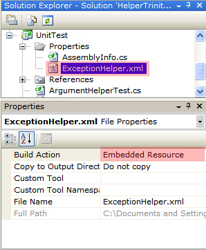

# `ExceptionHelper`

The `ExceptionHelper` class provides helper methods for resolving and raising exceptions. The main advantage to using the `ExceptionHelper` class is that your exception messages are centralized and easy to review for consistency and correctness. Another advantage is that your code will be cleaner and therefore clearer. 

## Set Up

By default, the `ExceptionHelper` class relies on finding your exception messages in an embedded resource called *[assemblyName].Properties.ExceptionHelper.xml*, where the assembly name is determined by the type you pass to the `ExceptionHelper` constructor. The easiest way to set this up in Visual Studio is: 

1. Add a new XML file called *ExceptionHelper.xml* to your project.
2. View the properties of this file and change the *Build Action* to *Embedded Resource*.
3. Drag the file under the *Properties* directory of your project.

The end result should resemble this: 



Sometimes the default resource name will not work, such as when the assembly name does not match the root namespace (common for executable assemblies). To address this case, `ExceptionHelper` provides a constructor overload that allows you to specify a custom resource name.

## *ExceptionHelper.xml* Format

The format of the ExceptionHelper.xml file is quite simple. For each exception that you might throw, you should include an `<exception/>` element. These elements are grouped under `<exceptionGroup>` elements according to the type that might throw the exception. Here is an example: 

```XML
<?xml version="1.0" encoding="utf-8" ?> 

<exceptionHelper> 
    <exceptionGroup type="MyNamespace.MyType, MyAssembly"> 
        <exception key="missing" type="System.InvalidOperationException">
            I can't find the byte array.
        </exception> 

        <exception key="tooBig" type="System.InvalidOperationException">
            I found the byte array but it is too big ({0} bytes).
        </exception> 
    </exceptionGroup> 

    <exceptionGroup type="MyNamespace.MyOtherType, MyAssembly"> 
        <exception key="missing" type="MyNamespace.MyException, MyAssembly">
            I can't find the string.
        </exception> 
    </exceptionGroup> 
</exceptionHelper>
```

When the `ExceptionHelper` needs to throw an exception, it will attempt to look up the exception details in this XML document. The type you pass to the `ExceptionHelper` constructor is used to find the correct exception group. This means that different types can use the same exception key without clashing. 

Notice also that that the messages can include parameters, as is the case with the "tooBig" exception above. These parameters adhere to standard .NET formatting conventions. 

## `Resolve()`

The `Resolve()` methods are used to simply resolve an exception instance so that you can subsequently throw it: 

```C#
public class MyClass
{
    private static readonly ExceptionHelper _exceptionHelper = new ExceptionHelper(typeof(MyClass));

    public void MyMethod()
    {
        try
        {
            // dangerous call here
        }
        catch (IOException ex)
        {
            // throw a different exception that wraps the IOException 
            throw _exceptionHelper.Resolve("SomeKey", ex);
        }
    }
}
```

Various overloads exist so that you can pass message arguments and additional constructor arguments.

## `ResolveAndThrowIf()`

The `ResolveAndThrowIf()` methods will resolve and throw an exception, but only if a specified condition is `true`. Various overloads exist so that you can pass message parameters, pass an inner exception, and pass additional constructor arguments for the exception type. A simple example of usage is:

```C#
public class MyClass : IDisposable
{
    private static readonly ExceptionHelper _exceptionHelper = new ExceptionHelper(typeof(MyClass));
    private bool _disposed;

    public void Dispose()
    {
        _disposed = true;
        // other clean up code
    }

    public void MyMethod()
    {
        _exceptionHelper.ResolveAndThrowIf(_disposed, "ObjectDisposed");
        // other logic
    }
}
```

In this example, `MyMethod()` will throw an exception if the object has already been disposed. The exception group might be declared in the *ExceptionHelper.xml* file like this:

```XML
<exceptionGroup type="MyClass, MyAssembly"> 
    <exception key="ObjectDisposed" type="System.ObjectDisposedException">
        Cannot access a disposed instance of MyClass.
    </exception> 
</exceptionGroup>
```

A more complicated example of using `ResolveAndThrowIf()` is:

```C#
public class MyClass
{
    private static readonly ExceptionHelper _exceptionHelper = new ExceptionHelper(typeof(MyClass));
    private const int _minLength = 3;
    private const int _maxLength = 6;

    public void MyMethod(string userName)
    {
        userName.AssertNotNull("userName");
        _exceptionHelper.ResolveAndThrowIf(
                     userName.Length < _minLength || userName.Length > _maxLength,
                     "InvalidUserName",
                     userName,
                     _minLength,
                     _maxLength);

        // other logic
    }
}
```

The corresponding *ExceptionHelper.xml* might look like this:

```XML
<exceptionGroup type="MyClass, MyAssembly"> 
    <exception key="InvalidUserName" type="System.ArgumentException">
        User name '{0}' is not between {1} and {2} characters long.
    </exception> 
</exceptionGroup>
```